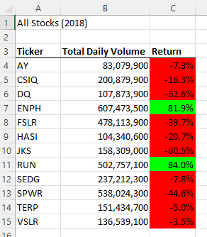

# Stock-Analysis

## Overview of project
Using the starter coded "challenge_starter_code.vbs" provided the original Excel file "green_stocks.xlsm" was refactored using Arrays() along with other Excel VBA methods to loop through the data provided to analyze the returns of specific stocks. 

## Results
The refactored code imporved from 1.007813 seconds down to 0.5703125 seconds
Original run of Excel file "green_stocks.xlsm" took 1.007813 seconds:

After refactoring code it ran in 0.5703125 seconds:

This improved the time by ~56.6%!

## Summary 
By refactoring the VBA code to hold the stock tickers in an Array this allows Excel VBA to better manage the memory allocation during execution of the code. In this small sample this more than doubled the speed the code was able to execute. 

The results of the refactored code for 2018 produced the same results as the non-factored VBA code: 

### Advantages
Advantages allow the code to execute at a greater speed and improve overall functionality of the worksheet. This can allow for greater flexability of more (or less) stock companies if the rows were to increase beyond the reports sample set. 

### Disadvantages
A few additional enhancements could create greater flexability with the code: 
* Allow the tickers() array to be dynamically created by going to the specific year worksheet then finding the unique values inside the column "A" (Ticker)
* Worksheet only allows for 2 years of analysis (2017, 2018). If there are additional years provided then some code rework would be needed to maybe build a better user interface to list the "years" in the worksheet

### Additional VBA Enhancements outside scope of project
The following enhancements were added to provider a better user experience 
* A new funciton (ClearActiveCells) was created to clear any formatting created after the "first" run of the code was completed. Current code "over wrote" whatever was on the Excel worksheet "All Stocks Analysis", this programatically deleted the data
* Additional code was added in the Procedure "AllStocksAnalysisRefactored" to check and see if the worksheet "All Stocks Analysis" was in the workbook, if not create the worksheet and put at the beginning of the workbook. 
* A "Do .. Loop Until" was used vs an If Statement to ensure the user was picking a year that had data. This could be refactored in additional years were added in the worksheet by using an Array of the worksheet names
