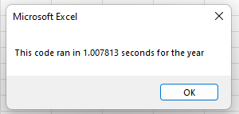
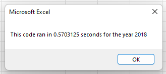

# Stock-Analysis

## Overview of project
Using the starter coded "challenge_starter_code.vbs" provided the original Excel file "green_stocks.xlsm" was refactored using Arrays() along with other Excel VBA methods to loop through the data provided to analyze the returns of specific stocks. 

## Results
The refactored code imporved from 1.007813 seconds down to 0.5703125 seconds
Original run of Excel file "green_stocks.xlsm" took 1.007813 seconds

After refactoring code it ran in 0.5703125 seconds

This improved the time by ~56.6%!

## Summary 

### Advantages

### Disadvantages
